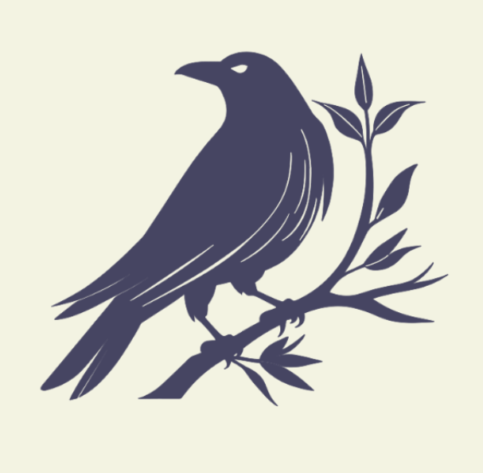

<div align="center">
    
    <h1>Krai</h1>
    
    
</div>

Krai is a modern, general-purpose low-level programming language that aims to be:
- A safer C
- A friendlier Rust
- A more documented Odin

Krai's philosophy is "explicit > clever." It only hurts when you're actually stupid.

## Quick Look

```rust
const std = import("std");

$parse_json() Tree ! Error -> {
    # ...
}

$main!() -> {
    # Memory allocation
    let buf = std.mem.alloc<u8>(1024); # Uses global allocator
    defer std.mem.free(buf);
    
    # Error handling that scales
    let data = std.io.read_file_to_string("config.json")?;
    defer std.mem.free(data);
    let parsed = parse_json(data) ?? default;
    defer parsed.free();
}
